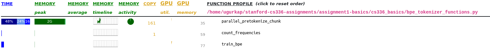

## 2.1 `unicode1`

1. What Unicode character does chr(0) return?  
--> '\x00'

2. How does this character’s string representation (__repr__()) differ from its printed representation?  
--> When printed, it is an empty character.

3. What happens when this character occurs in text?
--> When printed, it behaves as an empty character. But when you look at the string, you can see the added bytes.  

## 2.2 `unicode2`

1. What are some reasons to prefer training our tokenizer on UTF-8 encoded bytes, rather than UTF-16 or UTF-32?  
--> Because in UTF-16 and UTF-32, you always need at least 2 and 4 bytes to represent one character, respectively. However, this is a waste of space and sequence, as most characters can be represented with 1 byte, as UTF-8 does and only need multiple bytes when representing larger numbers.

2. Consider the following (incorrect) function, which is intended to decode a UTF-8 byte string into a Unicode string. Why is this function incorrect? Provide an example of an input byte string that yields incorrect results.  

```python
def decode_utf8_bytes_to_str_wrong(bytestring: bytes):
    return "".join([bytes([b]).decode("utf-8") for b in bytestring])
```

--> This code assumes every character is represented by 1 byte, and this assumption would fail fairly quickly when it comes across any non-ascii characters. Example: If you provide "uğur" as an input, you get a `UnicodeDecodeError` exception:  
`UnicodeDecodeError: 'utf-8' codec can't decode byte 0xc4 in position 0: unexpected end of data`

3. Give a two byte sequence that does not decode to any Unicode character(s).  
--> Not all byte sequences are valid. One such example is to have a continuation byte at the start of a character, e.g. `10111111`. So, for example `10111111 11001111` would not decode to any characters.  
Test:
```python
c =  0b1011111111001111
c.to_bytes(2).decode("utf-8")
```
will raise `UnicodeDecodeError: 'utf-8' codec can't decode byte 0xbf in position 0: invalid start byte`

## 2.4 BPE Tokenizer Training

## `train_bpe_tinystories`

1. Train a byte-level BPE tokenizer on the TinyStories dataset, using a maximum vocabulary size of 10,000. How many hours and memory did training take? What is the longest token in the vocabulary? Does it make sense?  
--> It used around 2 GBs of peak memory when actively running. For memory, main bottleneck was reading the chunks and keeping them in memory. It takes around 2-2.5 minutes to complete the training. The longest token in the vocabulary is `b' accomplishment'`, at index `7160` (`max(vocab.items(), key=lambda x: len(x[1]))`). It makes sense, and from the 6904th merge you can see it is the combination of `(b' accomplish', b'ment')`.

2. Profile your code. What part of the tokenizer training process takes the most time?  
--> Most memory is used in the pretokenization part, as well as the most time. The memory usage peaks when reading the text chunks from the disk, and also when splitting and rejoining the text on special tokens, whereas the most processing time is spent on regex pattern matching (29% of the running time). The actual BPE training time is 8% of the training time.



## `train_bpe_expts_owt`

1. Train a byte-level BPE tokenizer on the OpenWebText dataset, using a maximum vocabulary size of 32,000. What is the longest token in the vocabulary? Does it make sense?  
--> Longest token is at index `25822`, with a value of `b'\xc3\x83\xc3\x82\xc3\x83\xc3\x82\xc3\x83\xc3\x82\xc3\x83\xc3\x82\xc3\x83\xc3\x82\xc3\x83\xc3\x82\xc3\x83\xc3\x82\xc3\x83\xc3\x82\xc3\x83\xc3\x82\xc3\x83\xc3\x82\xc3\x83\xc3\x82\xc3\x83\xc3\x82\xc3\x83\xc3\x82\xc3\x83\xc3\x82\xc3\x83\xc3\x82\xc3\x83\xc3\x82'` or `'ÃÂÃÂÃÂÃÂÃÂÃÂÃÂÃÂÃÂÃÂÃÂÃÂÃÂÃÂÃÂÃÂ'` when decoded with UTF-8. This seems to be double-encoded UTF-8, an artifact from web scraping.

2. Compare and contrast the tokenizer that you get training on TinyStories versus OpenWebText.  
--> Even though OpenWebText tried to exclude non-English documents, we clearly got some artifacts introduced by it being real data. BPE trained on it also learned interesting artifacts. As OWT tokenizer has a larger and presumably more diverse vocabulary, I would expect it to be more efficient in turning byte sequences into token IDs. TinyStories tokenizer on the other hand should have cleaner text, but less diverse outputs as stories were generated by GPT-4, which has a certain linguistic output pattern to it.

## `tokenizer_experiments`

1. What is each tokenizer’s compression ratio (bytes/token)?  
--> OWT Tokenizer, Compression Ratio:            ~4.50 bytes/token  
    TinyStories Tokenizer, Compression Ratio:    ~4.01 bytes/token  

2. What happens if you tokenize your OpenWebText sample with the TinyStories tokenizer? Compare the compression ratio and/or qualitatively describe what happens.  
--> OWT Tokenizer on TinyStories samples, Compression Ratio:    ~3.87 bytes/token  
    TinyStories Tokenizer on OWT samples, Compression Ratio:    ~3.40 bytes/token  

3. Estimate the throughput of your tokenizer (e.g., in bytes/second). How long would it take to tokenize the Pile dataset (825GB of text)?  
--> Input processing speed is highly dependent on the vocabulary size (and the number of merges).  
    OWT Input Throughput: ~713258.83 bytes/second  
    TinyStories Input Throughput: ~697562.09 bytes/second  
    Pile Dataset Processing for OWT Tokenizer: 825e+9 / 713258.83 = ~14 days  
    Pile Dataset Processing for TinyStories Tokenizer: 825e+9 / 697562.09 = ~14 days  

4. Using your TinyStories and OpenWebText tokenizers, encode the respective training and development datasets into a sequence of integer token IDs. We’ll use this later to train our language model. We recommend serializing the token IDs as a NumPy array of datatype uint16. Why is uint16 an appropriate choice?  
--> uint8 has a maximum value of 255, and uint16 has a maximum value of 65535, which can represent each of the 32k tokens in the vocabulary. Having the data type unsigned signals these are supposed to be positive numbers, and potentially make it more extensible, i.e. for continued pretraining. We do not want to waste the negative 32k range.

## `transformer_accounting`

1. ...  
2. Identify the matrix multiplies required to complete a forward pass of our GPT-2 XL-shaped model. How many FLOPs do these matrix multiplies require in total? Assume that our input sequence has context_length tokens.  

--> Calculation:  

For 1 Transformer Block:  

2 RMS -> Negligble  
1 MHA  
1 FF  
  
For 1 FF:  
  
2 x batch_size x (seq_len x d_model x d_ff)  
2 x batch_size x (seq_len x d_ff x d_model)  
2 x batch_size x (seq_len x d_model x d_ff)  
  
= 6 x batch_size x seq_len x d_model x d_ff  

For 1 MHA (with RoPE):  

2 x 3 x batch_size x (seq_len x d_model x num_heads x d_k) # From q,k,v projection  
2 x 2 x batch_size x seq_len x d_model -> Negligible # From RoPE on k, q  
2 x batch_size x seq_len x num_heads x d_k x seq_len # Dot product between k and q  
2 x batch_size x seq_len x seq_len x num_heads x d_v # weighted sum  
2 x batch_size x (seq_len x num_heads x d_v x d_model) # final projection  

Assume d_model = num_heads x d_k and d_k = d_v  
  
Then:  

6 x b x s x d x d  
4 x b x s x d -> Negligible  
2 x b x s x d x s  
2 x b x s x s x d  
2 x b x s x d x d  

= 8 x bsd^2  + 4 x bs^2d  

For 1 RMSNorm: No matrix multiply, negligible  

So, 1 transformer block:  

(6 x b x seq x d_model x d_ff) + (8 x b x seq x d_model x d_model) + (4 x b x seq x seq x d)  

Then, for a Transformer LM, forward pass costs:  

Embedding : None (Look-Up)  
Transformer Blocks: num_layers x (6bsdd_ff + 8bsd^2 + 4bs^2d)  
RMS: Negligible  
Out Projection: 2bsdv  

Then:

- Transformer Blocks: 48 x (6 x 1024 x 1600 x 6400 + 8 x 1024 x 1600 x 1600 + 4 x 1024 x 1024 x 1600) = 4.3486544e+12
- Output Projection: 2 x 1024 x 1600 x 50257 = 0.164682137600e+12
- Total: ~4.5 TFLOPs

3.  Based on your analysis above, which parts of the model require the most FLOPs?  
--> Most FLOPs are required for the dot product between keys and queries in the attention. Weighted sum of attention can also be costly depending on if context length is significant compared to the model dimension. One interesting factor we can notice here is that we didn't actually need to assume n_heads x d_k was equal to d_model but we just assumed by convention. So, one can play around with the number of heads. And in the SwiGLU case, feedforward network is also spending a lot of FLOPs. Output projection also takes a lot of FLOPs relative to what it is doing, and scales by the size of the vocabulary.  

4. 